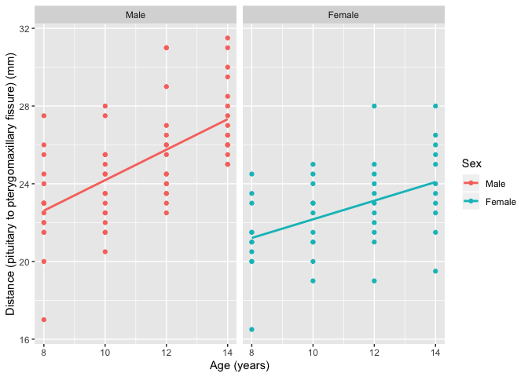
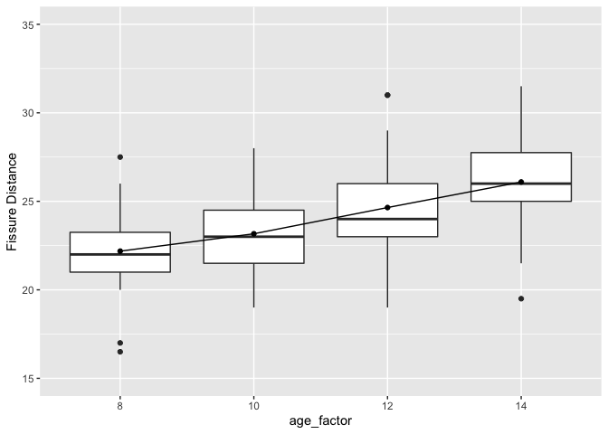
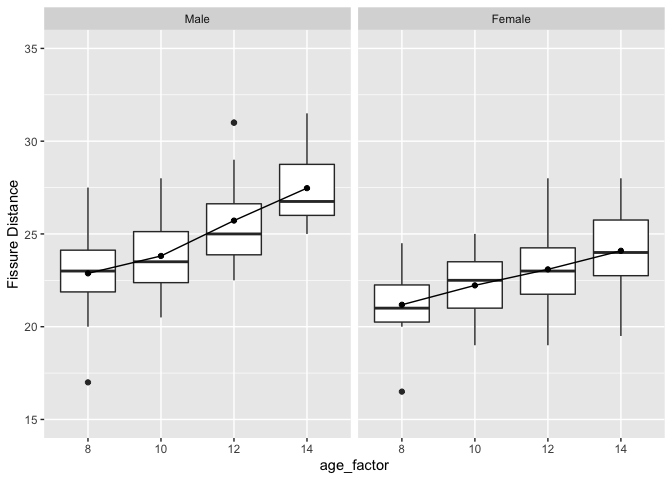
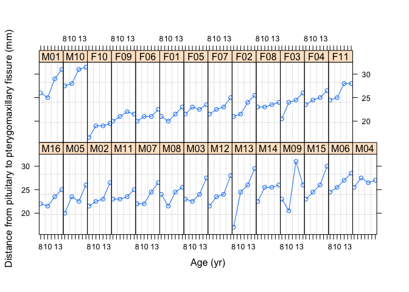

HDAT9700: Assessment 1C - Chapters 6, 7 and 8
================
Alexander Kruskal
25 November 2019

### Submission instructions

This is an R Markdown document—an example of *literate programming*, an
approach which allows users to interweave text, statistical output and
the code that produces that output.

To complete your assignment:

  - Edit this file directly, interweaving text and R code as appropriate
    to answer the questions below. Remember to `Knit` the file to make
    sure everything is running smoothly. Detailed information on R
    Markdown is available
    [here](https://rmarkdown.rstudio.com/lesson-1.html), and there is a
    useful cheatsheet
    [here](https://www.rstudio.com/wp-content/uploads/2015/02/rmarkdown-cheatsheet.pdf).

  - Use git to `commit` changes you make in this repo locally.

  - `Push` the repo, together with this edited file and the
    corresponding `.md` file to GitHub Classroom.

You can `commit` and `push` as often as neccessary—your assessment will
be graded on the most recent version of your repo at the assessment due
date.

Good luck\!

-----

### Overview

In this assignment we are going to analyse the `Orthodont` data,
available in the `nlme` package. These data include longitudinal
information from a study at the University of North Carolina Dental
School. Investigators followed the growth of children from age 8 until
age 14. Every two years they measured the distance between the pituitary
and the pterygomaxillary fissure, two points that are easily identified
on x-ray exposures of the side of the head.

This data frame contains the following four variables:

  - **distance** A numeric vector of distances from the pituitary to the
    pterygomaxillary fissure (measured in mm). These distances are
    measured on x-ray images of the skull

  - **age** a numeric vector of ages of the subject (in years)

  - **Subject** A unique person identifier indicating the subject on
    which the measurement was made. The levels are labelled M01 to M16
    for the males and F01 to F13 for the females.

  - **Sex** a binary variable with levels Male and Female

As the `nlme` package is one of the core R packages, you don’t need to
separately install it. To get started, you just need to load it into the
workspace in R with `library(nlme)` command. We will also use the
function ggplot to produce figures. Load this into the workspace with
`library(gglopt2)`.

Please provide the R code needed to answer the following exercises as
well as your written answers to them.

-----

### Assignment

``` r
library(nlme)
library(ggplot2)
library(DiagrammeR)
library(lme4)
```

    ## Loading required package: Matrix

    ## 
    ## Attaching package: 'lme4'

    ## The following object is masked from 'package:nlme':
    ## 
    ##     lmList

``` r
library(nlme)
```

\#\#\#\#1. Familiarise yourself with the Orthodont dataset. i. How many
rows (observations) are there in the dataset, and how many children are
there in the dataset? \[3 marks\] ii. Provide frequencies (%) for the
categories of the categorical variables, and median and 1st and 3rd
quartiles for the continuous variables. \[3
marks\]

\#\#\#\#\#i)

``` r
print(paste('There are', dim(Orthodont)[1], 'rows of observations.'))
```

    ## [1] "There are 108 rows of observations."

``` r
print(paste('There are', length(unique(Orthodont$Subject)), 'children in the dataset.'))
```

    ## [1] "There are 27 children in the dataset."

There are 108 rows of observations and 27 children in the dataset.

\#\#\#\#\#ii)

    ##     distance          age          Subject       Sex    
    ##  Min.   :16.50   Min.   : 8.0   M16    : 4   Male  :64  
    ##  1st Qu.:22.00   1st Qu.: 9.5   M05    : 4   Female:44  
    ##  Median :23.75   Median :11.0   M02    : 4              
    ##  Mean   :24.02   Mean   :11.0   M11    : 4              
    ##  3rd Qu.:26.00   3rd Qu.:12.5   M07    : 4              
    ##  Max.   :31.50   Max.   :14.0   M08    : 4              
    ##                                 (Other):84

    ## [1] "Percentages Male/Female"

    ## 
    ##     Male   Female 
    ## 59.25926 40.74074

\#\#\#\#2. In this assignment, we are interested in modelling the
variable **distance** as a function of **age** and **sex**. i) What is
the multilevel structure of this dataset? \[3 marks\] ii) Age will be
modelled as a random effect for the analysis. Why might this be
appropriate? \[5 marks\] iii) Use the function `ggplot()` and the
following code to produce a scatterplot of age by distance, separately
for each sex. Summarise the relationship between distance, age and sex.
\[3
    marks\]

\#\#\#\#\#i)

    ## PhantomJS not found. You can install it with webshot::install_phantomjs(). If it is installed, please make sure the phantomjs executable can be found via the PATH variable.

<!--html_preserve-->

<div id="htmlwidget-8a64e75a3098b1583b6a" class="grViz html-widget" style="width:672px;height:480px;">

</div>

<script type="application/json" data-for="htmlwidget-8a64e75a3098b1583b6a">{"x":{"diagram":"digraph flowchart {\n      # node definitions with substituted label text\n      node [fontname = Helvetica, shape = rectangle]        \n      tab1 [label = \"Male\"]\n      tab2 [label = \"Female\"]\n      tab3 [label = \"Patient (Level 2)\"]\n      tab4 [label = \"Age 1 -> Age 2 -> Age 3 -> Age 4 (Level 1)\"]\n      tab5 [label = \"Patient (Level 2)\"]\n      tab6 [label = \"Age 1 -> Age 2 -> Age 3 -> Age 4 (Level 1)\"]\n\n      # edge definitions with the node IDs\n      tab1 -> tab3 -> tab4;\n      tab2 -> tab5 -> tab6;\n      }","config":{"engine":"dot","options":null}},"evals":[],"jsHooks":[]}</script>

<!--/html_preserve-->

\#\#\#\#\#ii) Age is an appropriate random effect for the analysis
because we are trying to determine what the effect of age is on the
distance between the pituitary and pterygomaxillary fissure. If we
considered age a fixed effect, we would not be able to see the
difference in size by age.

\#\#\#\#\#iii)

<!-- -->

Male and female Children appear to have an increased distance between
the pituitary and pterygomaxillary fissure as they increase in age, but
males seem to have a larger increase in distance with respect to age
compared to females.

\#\#\#\#3. We will now begin to build a regression model to further
investigate the relationship between **distance**, **age** and **sex**.
We would like to test the hypothesis that age and sex are significantly
related to distance. i) Create a single-level intercept-only model for
distance. \[3 marks\]

``` r
single_level_model <- gls(distance ~ 1, 
                    data = Orthodont, method = "ML", na.action = na.exclude)
```

    ii) Create a variance-components (intercept only) model for distance with a random intercept. [3 marks] 

``` r
variance_components_model <- lme(distance ~ 1, random = ~1|Subject,
                    data = Orthodont, method = "ML", na.action = na.exclude)

variance_components_model_lmer <-lmer(distance ~ (1|Subject), 
                                      data=Orthodont, REML = FALSE)
```

    iii) Perform a likelihood ratio test to compare the goodness-of-fit of the two models in 3i) and 3b). [3 marks]

``` r
logLik(single_level_model)  
```

    ## 'log Lik.' -268.7908 (df=2)

``` r
logLik(variance_components_model)
```

    ## 'log Lik.' -257.7456 (df=3)

    iv) What proportion of the variation in distance is at the individual level? [3 marks]

``` r
vc1 <- as.data.frame(VarCorr(variance_components_model_lmer))
sig_u_sq <- vc1[1,4]
sig_e_sq <- vc1[2,4]

vpc <- sig_u_sq/(sig_u_sq + sig_e_sq)
vpc
```

    ## [1] 0.4198309

The proportion of the variation in distance at the individual level is
approximately
    42%.

    v) In this study, is it justified to use a hierarchical model? [3 marks]

It is Justified to use a hiercarchal model because the patient is a
relatively large explanation for the variance in size and the log
likelyhood is larger for the empty variance components model.

\#\#\#\#4. We will now incorporate the variable **age** into the model
created in 3ii) above. i) Create a longitudinal multilevel linear model
with random intercept only to investigate the effect of age on distance
(distance ~ age). \[3 marks\]

``` r
long_randint_linear_model <- lme(distance ~ age, random = ~1|Subject,
                    data = Orthodont, method = "ML", na.action = na.exclude)
```

    ii) Now add a random slope to the variable age in the longitudinal multilevel linear model created in 4i). [3 marks]
    
    
    ```r
    long_randslope_linear_model <- lme(distance ~ age, random = ~ 1 + age|Subject,
                    data = Orthodont, method = "ML", na.action = na.exclude)
    ```
    
    iii) Perform a likelihood ratio test to compare the goodness-of-fit of the two models in 4i) and 4ii). [3 marks]

``` r
anova(long_randint_linear_model, long_randslope_linear_model)
```

    ##                             Model df      AIC      BIC    logLik   Test
    ## long_randint_linear_model       1  4 451.3895 462.1181 -221.6948       
    ## long_randslope_linear_model     2  6 451.2116 467.3044 -219.6058 1 vs 2
    ##                              L.Ratio p-value
    ## long_randint_linear_model                   
    ## long_randslope_linear_model 4.177941  0.1238

    iv)  What is the sign of the estimated covariance parameter from the random part of the model, and what does this suggest about the relationship between random intercepts and random slopes? [6 marks]

``` r
summary(long_randslope_linear_model)
```

    ## Linear mixed-effects model fit by maximum likelihood
    ##  Data: Orthodont 
    ##        AIC      BIC    logLik
    ##   451.2116 467.3044 -219.6058
    ## 
    ## Random effects:
    ##  Formula: ~1 + age | Subject
    ##  Structure: General positive-definite, Log-Cholesky parametrization
    ##             StdDev    Corr  
    ## (Intercept) 2.1940996 (Intr)
    ## age         0.2149244 -0.581
    ## Residual    1.3100399       
    ## 
    ## Fixed effects: distance ~ age 
    ##                 Value Std.Error DF   t-value p-value
    ## (Intercept) 16.761111 0.7678975 80 21.827278       0
    ## age          0.660185 0.0705779 80  9.353997       0
    ##  Correlation: 
    ##     (Intr)
    ## age -0.848
    ## 
    ## Standardized Within-Group Residuals:
    ##          Min           Q1          Med           Q3          Max 
    ## -3.305969305 -0.487429621  0.007597971  0.482237071  3.922789749 
    ## 
    ## Number of Observations: 108
    ## Number of Groups: 27

The covarianace parameter is negative which suggests that as people age,
the distance between the fissures become less varied, but it is not a
large
    correlation.

    v) Draw a plot to help assess whether the posterior estimates of the random intercepts and random slopes are normally distributed. [6 marks]

``` r
Orthodont$age_factor <- factor(Orthodont$age)

boxplot_Orth <- ggplot(Orthodont, aes(x = age_factor, y = distance)) +        geom_boxplot() + 
scale_y_continuous(name = "Fissure Distance", limits=c(15, 35)) + stat_summary(fun.y=mean, geom="line", aes(group=1))  + 
stat_summary(fun.y=mean, geom="point") 

boxplot_Orth
```

<!-- -->

``` r
boxplot_sex <- ggplot(Orthodont, aes(x = age_factor, y = distance)) +        geom_boxplot() + 
scale_y_continuous(name = "Fissure Distance", limits=c(15, 35)) + stat_summary(fun.y=mean, geom="line", aes(group=1))  + 
stat_summary(fun.y=mean, geom="point") +
facet_wrap(~Sex)

boxplot_sex
```

<!-- -->

``` r
plot(Orthodont)
```

<!-- -->

    vi) In this study, does the use of a random slope for age improve the goodness-of-fit of the model? [3 marks] 
    
    The random slope for age does not appear to improve the goodness-of-fit for the model, with almost exactly the same AIC of about 451, and a lower BIC for the random intercept model, suggesting the random intercept is the better model to use because it is simpler and just as good.
    If you seperate by sex though, the random slope for age looks like it may be justified, atleast for males - but because we want to see if there is a difference by sex, we will not run sex as a random effect.

\#\#\#\#5. In this exercise, we will test whether the relationship
between **age** and **distance** is improved by the use of a non-linear
quadratic function in the regression model (i.e. a growth curve model).
i) Based on your results in section 4 above, which model will you use as
the basis for your growth curve model? **Justify your choice** \[3
marks\] \* Random intercept only (4i)?

``` 
    * Random intercept and slope (4ii)?
```

I would use 4i because when doing a log-likelyhood test, the AIC was the
same and the BIC was better for the simpler model, and one should always
use the simpler model when two models perform the
    same.

    ii) Now perform a growth curve analysis by adding the term `age^2` to the model you have selected in 5i). [3 marks] 

``` r
quadratic_model <- lme(distance ~ age + age^2, random = ~1|Subject,
                    data = Orthodont, method = "ML", na.action = na.exclude)
```

    iii) Use the anova() function to perform a likelihood ratio test to compare the goodness-of-fit of the two models: 5ii) and either 4i) or 4ii). [3 marks]

``` r
anova(long_randint_linear_model, quadratic_model)
```

    ##                           Model df      AIC      BIC    logLik
    ## long_randint_linear_model     1  4 451.3895 462.1181 -221.6948
    ## quadratic_model               2  4 451.3895 462.1181 -221.6948

    iv) In this study, does the use of a non-linear quadratic term for age improve the goodness-of-fit of the model? [3 marks]
    
    The use of a quadratic term for age does not improve the goodness of fit for this model.

\#\#\#\#6. For our final model, we will now add the fixed effect **sex**
to our model of the relationship between distance and age. i) Which
model would you choose as your final random effects model? \[3 marks\]
\* Random intercept only with no quadratic term (linear model) \* Random
intercept only with quadratic term (growth curve model)? \* Random
intercept and slope with no quadratic term (linear model) \* Random
intercept and slope with quadratic term (growth curve
model)?

``` 
    I would use the random intercept only with no qudratic term as my final model.
    
ii) Add the fixed effect **Sex** to the model chosen in 6i). Is there a significant relationship between distance and sex? [3 marks]
```

``` r
model_fixed_sex <- lme(distance ~ age + Sex, random = ~1|Subject,
                    data = Orthodont, method = "ML", na.action = na.exclude)

summary(model_fixed_sex)
```

    ## Linear mixed-effects model fit by maximum likelihood
    ##  Data: Orthodont 
    ##        AIC      BIC    logLik
    ##   444.8565 458.2671 -217.4282
    ## 
    ## Random effects:
    ##  Formula: ~1 | Subject
    ##         (Intercept) Residual
    ## StdDev:    1.730079 1.422728
    ## 
    ## Fixed effects: distance ~ age + Sex 
    ##                 Value Std.Error DF   t-value p-value
    ## (Intercept) 17.706713 0.8315459 80 21.293729  0.0000
    ## age          0.660185 0.0620929 80 10.632212  0.0000
    ## SexFemale   -2.321023 0.7430668 25 -3.123572  0.0045
    ##  Correlation: 
    ##           (Intr) age   
    ## age       -0.821       
    ## SexFemale -0.364  0.000
    ## 
    ## Standardized Within-Group Residuals:
    ##         Min          Q1         Med          Q3         Max 
    ## -3.77682007 -0.55426744 -0.01578248  0.45835495  3.68124620 
    ## 
    ## Number of Observations: 108
    ## Number of Groups: 27

    The fixed effect of sex shows that females have approximately 2.32 mm less distance between the petuitary and pterygomaxillary fissure and a significant p value of .0045, under .05.
    
    iii) Add an interaction term between the variables **sex** and **age**. Is this interaction significant? What does that mean? [3 marks]

``` r
model_interaction_sex <- lme(distance ~ age + Sex + Sex:age, random = ~1|Subject,
                    data = Orthodont, method = "ML", na.action = na.exclude)

summary(model_interaction_sex)
```

    ## Linear mixed-effects model fit by maximum likelihood
    ##  Data: Orthodont 
    ##        AIC      BIC    logLik
    ##   440.6391 456.7318 -214.3195
    ## 
    ## Random effects:
    ##  Formula: ~1 | Subject
    ##         (Intercept) Residual
    ## StdDev:    1.740851 1.369159
    ## 
    ## Fixed effects: distance ~ age + Sex + Sex:age 
    ##                   Value Std.Error DF   t-value p-value
    ## (Intercept)   16.340625 0.9814310 79 16.649795  0.0000
    ## age            0.784375 0.0779963 79 10.056564  0.0000
    ## SexFemale      1.032102 1.5376069 25  0.671239  0.5082
    ## age:SexFemale -0.304830 0.1221968 79 -2.494580  0.0147
    ##  Correlation: 
    ##               (Intr) age    SexFml
    ## age           -0.874              
    ## SexFemale     -0.638  0.558       
    ## age:SexFemale  0.558 -0.638 -0.874
    ## 
    ## Standardized Within-Group Residuals:
    ##         Min          Q1         Med          Q3         Max 
    ## -3.64686407 -0.46341443  0.01556892  0.52172245  3.73335102 
    ## 
    ## Number of Observations: 108
    ## Number of Groups: 27

``` r
anova(model_fixed_sex, model_interaction_sex)
```

    ##                       Model df      AIC      BIC    logLik   Test  L.Ratio
    ## model_fixed_sex           1  5 444.8565 458.2671 -217.4282                
    ## model_interaction_sex     2  6 440.6391 456.7318 -214.3195 1 vs 2 6.217427
    ##                       p-value
    ## model_fixed_sex              
    ## model_interaction_sex  0.0126

    The interaction between sex and age does seem significant with a p-value of .01. THis means that sex has an effect on the general trajectory - the growth curves look different - depending on sex. I touched upon this earlier when demonstrating the distance box plots by age when seperated by sex show different trends - female looking more linear and males lookingnon-linear.

\#\#\#\#7. Based on your final model, write a paragraph to report the
main findings of your analysis. Include the main statistical results
supported by key values from the output (hint: use the intervals()
function to obtain 95% intervals for your regression parameters).
Provide a very brief clinical interpretation of your findings (hint: do
the results support the hypothesis that there is a relationship between
distance, age and sex?). \[20 marks\]

``` r
intervals(model_fixed_sex)
```

    ## Approximate 95% confidence intervals
    ## 
    ##  Fixed effects:
    ##                  lower       est.      upper
    ## (Intercept) 16.0750295 17.7067130 19.3383965
    ## age          0.5383446  0.6601852  0.7820257
    ## SexFemale   -3.8299925 -2.3210227 -0.8120530
    ## attr(,"label")
    ## [1] "Fixed effects:"
    ## 
    ##  Random Effects:
    ##   Level: Subject 
    ##                   lower     est.    upper
    ## sd((Intercept)) 1.26524 1.730079 2.365695
    ## 
    ##  Within-group standard error:
    ##    lower     est.    upper 
    ## 1.219676 1.422728 1.659584

``` r
intervals(model_interaction_sex)
```

    ## Approximate 95% confidence intervals
    ## 
    ##  Fixed effects:
    ##                    lower       est.       upper
    ## (Intercept)   14.4236524 16.3406250 18.25759756
    ## age            0.6320293  0.7843750  0.93672072
    ## SexFemale     -2.0754615  1.0321023  4.13966600
    ## age:SexFemale -0.5435094 -0.3048295 -0.06614968
    ## attr(,"label")
    ## [1] "Fixed effects:"
    ## 
    ##  Random Effects:
    ##   Level: Subject 
    ##                    lower     est.    upper
    ## sd((Intercept)) 1.278285 1.740851 2.370803
    ## 
    ##  Within-group standard error:
    ##    lower     est.    upper 
    ## 1.173748 1.369159 1.597103

Testing progressively more complicated models to determine if sex and
age have an effect on distance between the pituitary and the
pterygomaxillary fissure, the least complicated model that showed
significant improvement before introducing sex as a variable was a
random intercept for each each subject. There were lower AIC’s and BIC’s
or smaller log-likelihood functions until introducing a random slope for
age. The 95% confidence intervals for the coefficient of age is .538 to
.782, the distance between the fissures increases every year and the 95%
confidence interval for SexFemale is between -3.83 and -.812 which means
that the distance between the fissures is is smaller for females.
Further,on average, the fissure distance increases about .66 mm per year
and is 2.32 mm smaller for females compared to males. There also appears
to be an interaction between sex and age, so the trend of distance
increasing by age appears to be different between females and males.

To conclude, because the 95% confidence intervals for age and sex do not
include 0, the hypothesis that distance and sex affect distance between
the pituitary and the pterygomaxillary fissure is supported; both sex
and age affect fissure distance.

-----

### Student declaration

***Instructions: Indicate that you understand and agree with the
following three statements by typing an x in the square brackets below,
e.g. \[x\].***

I declare that this assessment item is my own work, except where
acknowledged, and has not been submitted for academic credit elsewhere
or previously, or produced independently of this course (e.g. for a
third party such as your place of employment) and acknowledge that the
assessor of this item may, for the purpose of assessing this item: (i)
Reproduce this assessment item and provide a copy to another member of
the University; and/or (ii) Communicate a copy of this assessment item
to a plagiarism checking service (which may then retain a copy of the
assessment item on its database for the purpose of future plagiarism
checking).

  - \[x\] I understand and agree

I certify that I have read and understood the University Rules in
respect of Student Academic Misconduct.

  - \[x\] I understand and agree

I have a backup copy of the assessment.

  - \[x\] I understand and agree
